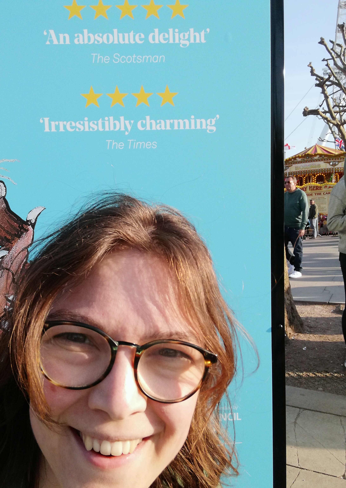



I obtained my Master's in Language Science and Technology from Saarland University in 2024. Before that, I did my Bachelor's in Natural Language Processing at the University of Stuttgart and spent the spring term of 2022 at Bogazici University in Istanbul. 

**My full CV:**

[Curriculum Vitae](../files/cv.pdf){:target="_blank"}

**TL;DR:**

